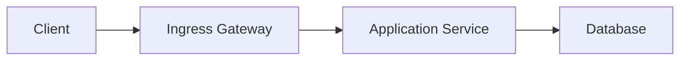

# Overview

This sample document demonstrates the starter repo structure and a renderable
Mermaid diagram.

## System Context

## Notes

Use this file as a first smoke test for linting and DOCX rendering.

