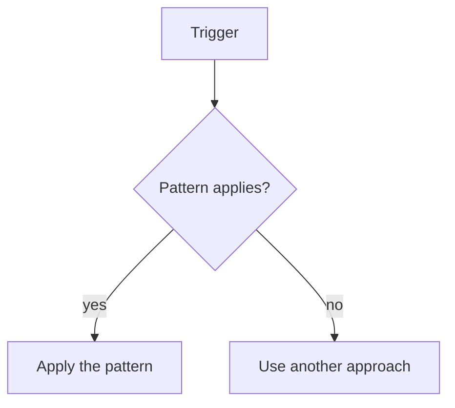

> Template note: remove guidance blocks before publishing.

# Problem

Describe the recurring problem this pattern solves.

# Pattern

Describe the recommended approach in normative, reusable language.

# When to Use

- Condition 1
- Condition 2

# When Not to Use

- Anti-pattern 1
- Boundary condition 2

# Example

